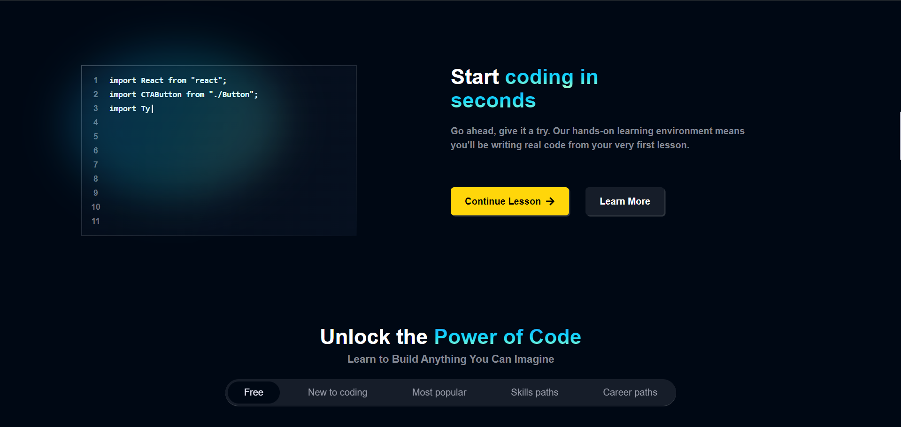
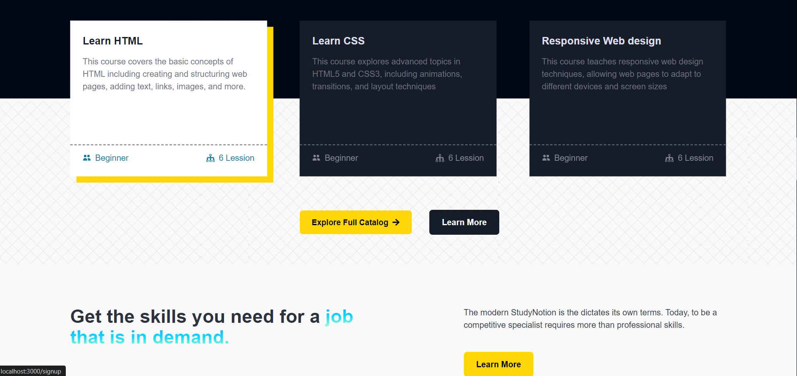
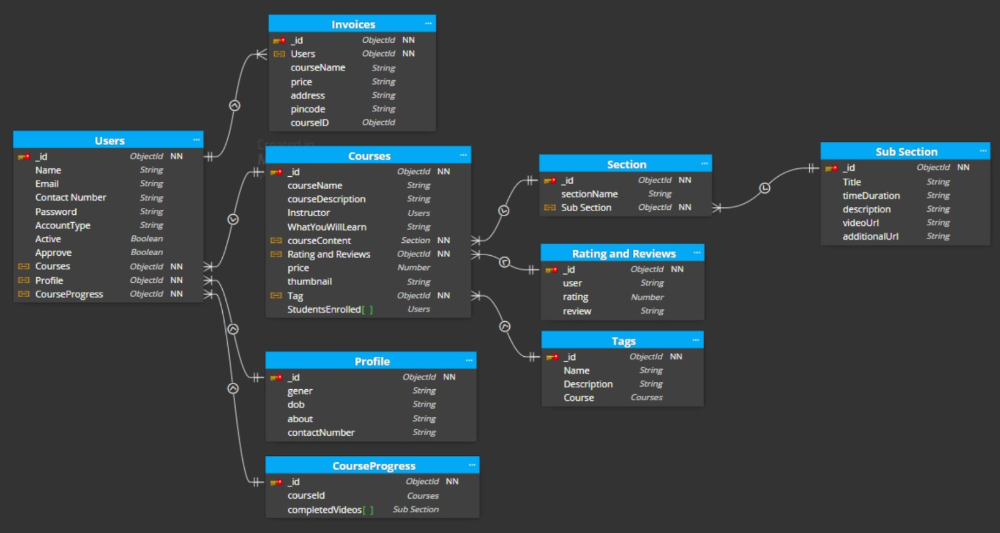
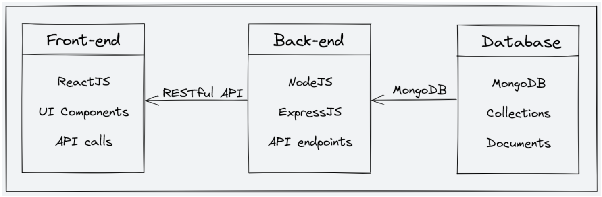

# StudyNotion
Link to Website -> https://study-notion-frontend-kanhaiya01.vercel.app/






StudyNotion is a fully functional ed-tech platform that enables users to create, consume, and rate educational content. The platform is built using the MERN stack, which includes ReactJS, NodeJS, MongoDB, and ExpressJS.

## Key Features

- **Seamless and Interactive Learning Experience**: Provides an engaging educational environment, making education more accessible.
- **Platform for Instructors**: Allows instructors to showcase their expertise and connect with learners globally.

## Table of Contents

1. [System Architecture](#system-architecture)
2. [Front-end](#front-end)
3. [Back-end](#back-end)
4. [Database](#database)
5. [API Design](#api-design)
6. [Deployment](#deployment)
7. [Testing](#testing)
8. [Future Enhancements](#future-enhancements)

## System Architecture

The StudyNotion ed-tech platform consists of three main components: the front end, the back end, and the database. The platform follows a client-server architecture, with the front end serving as the client and the back end and database serving as the server.

## Front-end

The front-end of the platform is built using **ReactJS**, which allows for the creation of dynamic and responsive user interfaces, crucial for providing an engaging learning experience to students. The front-end communicates with the back-end using RESTful API calls.

### Front End Pages

#### For Students:

- **Homepage**: Provides a brief introduction to the platform with links to the course list and user details.
- **Course List**: Displays a list of all the courses available on the platform, along with their descriptions and ratings.
- **Wishlist**: Shows all the courses that a student has added to their wishlist.
- **Cart Checkout**: Allows the user to complete purchases of courses.
- **Course Content**: Presents the course content for a particular course, including videos and related material.
- **User Details**: Displays information about the student's account, including their name, email, and other relevant information.
- **User Edit Details**: Allows students to edit their account details.

#### For Instructors:

- **Dashboard**: Offers an overview of the instructor's courses, along with ratings and feedback for each course.
- **Insights**: Provides detailed insights into the instructor's courses, including the number of views, clicks, and other relevant metrics.
- **Course Management Pages**: Enables instructors to create, update, and delete courses, as well as manage course content and pricing.
- **View and Edit Profile Details**: Allows instructors to view and edit their account details.

### Front-end Tools and Libraries

To build the front-end, the following frameworks and libraries are used:

- **ReactJS**: A JavaScript library for building user interfaces.
- **CSS**: Used for basic styling of the components.
- **Tailwind CSS**: A utility-first CSS framework for building custom designs.
- **Redux**: For state management, helping to manage and share application state efficiently.

---

This section provides a detailed breakdown of the front-end architecture, including the different pages available for both students and instructors and the tools and libraries used for development. This helps in understanding the user journey and the technical stack involved in the front-end of the StudyNotion platform.

## Back-end

The back-end of the platform is built using **NodeJS** and **ExpressJS**, providing APIs for the front-end to consume. These APIs include functionalities such as user authentication, course creation, and course consumption. The back-end also handles the logic for processing and storing course content and user data.

### Back-end Features

- **User Authentication and Authorization**:  
  Students and instructors can sign up and log in to the platform using their email addresses and passwords. The platform also supports OTP (One-Time Password) verification and forgot password functionality for added security.

- **Course Management**:  
  Instructors can create, read, update, and delete courses, as well as manage course content and media. Students can view and rate courses.

- **Payment Integration**:  
  Students can purchase and enroll in courses by completing the checkout flow, which is integrated with Razorpay for payment handling.

- **Cloud-based Media Management**:  
  StudyNotion uses **Cloudinary**, a cloud-based media management service, to store and manage all media content, including images, videos, and documents.

- **Markdown Formatting**:  
  Course content in document format is stored in Markdown format, allowing for easier display and rendering on the front-end.

### Back-end Frameworks, Libraries, and Tools

The back-end of StudyNotion uses various frameworks, libraries, and tools to ensure functionality and performance, including:

- **Node.js**: Used as the primary framework for the back-end.
- **Express.js**: Used as a web application framework, providing a range of features and tools for building web applications.
- **MongoDB**: Used as the primary database, providing a flexible and scalable data storage solution.
- **JWT (JSON Web Tokens)**: Used for authentication and authorization, providing a secure and reliable way to manage user credentials.
- **Bcrypt**: Used for password hashing, adding an extra layer of security to user data.
- **Mongoose**: Used as an Object Data Modeling (ODM) library, providing a way to interact with MongoDB using JavaScript.

### Data Models and Database Schema

The back-end of StudyNotion uses several data models and database schemas to manage data, including:

- **Student Schema**:  
  Includes fields such as name, email, password, and course details for each student.

- **Instructor Schema**:  
  Includes fields such as name, email, password, and course details for each instructor.

- **Course Schema**:  
  Includes fields such as course name, description, instructor details, and media content.

---

This section gives a detailed overview of the back-end architecture, features, frameworks, libraries, and tools used in the StudyNotion platform. It also explains the various data models and database schemas utilized to manage user and course data efficiently.

## Database

The StudyNotion platform utilizes MongoDB as its database solution. MongoDB is a NoSQL database known for its flexibility and scalability. It supports the storage of unstructured and semi-structured data, making it ideal for our use case.



## Architecture Diagram

Below is a high-level diagram that illustrates the architecture of the StudyNotion EdTech platform:



## API Design

The StudyNotion platform's API is designed following the REST architectural style. The API is implemented using Node.js and Express.js. It uses JSON for data exchange and follows standard HTTP request methods such as GET, POST, PUT, and DELETE.


## Installation

1. **Clone the repository:**

    ```bash
    git clone repo-link
    ```

2. **Navigate to the project directory:**

    ```bash
    cd StudyNotionFinal
    ```

3. **Install dependencies:**

    ```bash
    npm install
    ```

## Configuration

1. **Set up a MongoDB database and obtain the connection URL.**

2. **Create a `.env` file in the root directory with the following environment variables:**

    ```plaintext
    MONGODB_URI=<your-mongodb-connection-url>
    JWT_SECRET=<your-jwt-secret-key>
    ```
3. **Run your project**

